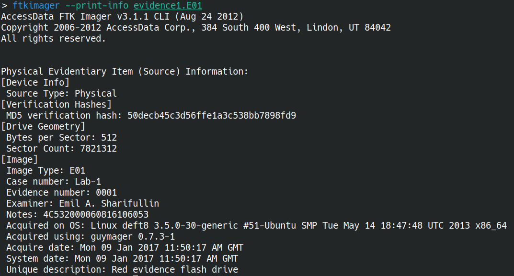

# Disk Imaging

> Reading: <https://forensics.wiki/disk_imaging/>

Disk imaging (duplication) is the process of making a bit-by-bit copy of a physical/logical disk, while ensuring that the original is not altered (e.g., using a hardware/software [write-blocker](https://forensics.wiki/write_blockers/)).

- The simplest approach involves reading a disk from start to end and writing raw data to a file.
- For large disks, full duplication is very slow and often unnecessary. Smarter approaches may involve compression, deduplication, and selective imaging.

## Practice

1. Create a ~50MB blob using disk-dump utility, initially filled with zeroes

    ```bash
    dd if=/dev/zero of=usb.img bs=512 count=100000
    ```

1. Create an Ext4 file system in the image

    ```bash
    mkfs.ext4 usb.img
    ```

1. Mount the file system at `/mnt/usb` (simulating a USB connect)

    ```bash
    sudo mkdir /mnt/usb
    sudo mount -t ext4 usb.img /mnt/usb
    ```

1. Create a file system for an Alpine Linux in the USB (may take a while).

    ```bash
    wget https://raw.githubusercontent.com/alpinelinux/alpine-make-rootfs/v0.7.2/alpine-make-rootfs
    sudo chmod +x alpine-make-rootfs
    sudo ./alpine-make-rootfs /mnt/usb
    ```

## Exercise 1

1. **Criminal**: create a file `secret.txt` in the usb with some content (e.g., a flag), then delete it and unmount the usb (simulating a USB disconnect).

1. **Technician**: using `ewf-tools`, convert raw `usb.img` into an EWF format (include some meta information like invistigator name and case number).

1. **Examiner**: Verify the resulting file and show metadata with `ewfinfo`. A more realistic case file may look like this:

    
