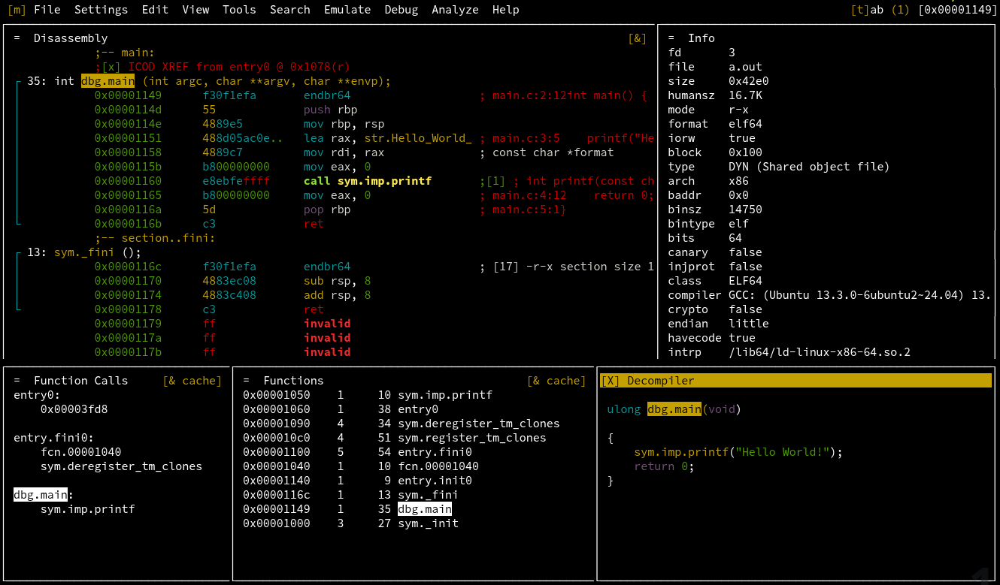

# Static Analysis

Static analysis of a malware artifact depends on the type of `file` being analyzed. In most cases, reverse engineering is necessary.
> Reverse-engineering a malware sample helps understand how it works, construct signatures, and potentially develop removers/patches (e.g., recovering ransomware-encrypted files).

## Tooling

- **Decompilers:** tools to reconstruct the higher-level programming language (e.g., C, Python, Java) from a given executable.
- **Disassemblers:** tools to translate machine code from the binary to a human-readable assembly instructions.
- **Debuggers:** tools to trace program execution step-by-step, useful for **dynamic analysis**

## Examples

Malware analyst toolkit may include these popular tools:

- **Linux executable binaries (ELF files):** GDB, Ghidra, IDA, and Radare2
  - Tools are initially developed with a narrower focus, but evolve with time to support more and more use cases.
  - One might say that GDB is mainly a debugger, Ghidra - a decompiler, IDA - a disassembler, and radare2 - a general reverse engineering toolkit.

- **Microsoft .NET executables:** JetBrains DotPeek or the open-source alternative ILSpy
- **Java-based artifacts (JAR, APK, Kotlin Bytecode)**: Java Decompilers

## Practice

1. Prerequisities

   ```bash
   sudo apt update && sudo apt install pkg-config cmake cmake-data libz-dev
   ```

1. Install radare2 (the recommended way)

   ```bash
   curl -Ls https://github.com/radareorg/radare2/releases/download/6.0.2/radare2-6.0.2.tar.xz | tar xJv
   radare2-6.0.2/sys/install.sh
   ```

1. Install ghidra plugin (for decompilation) using Radare2 package manager

   ```bash
   r2pm -U && r2pm -ci r2ghidra
   ```

1. Create `main.c`

   ```c
   #include <stdio.h>
   int main() {
       printf("Hello World!");
       return 0;
   }
   ```

1. Compile with debugging information included

   ```bash
   gcc -g main.c
   ```

1. Launch radare2, analyzing the binary on startup and setting some configuration variables.
   > Recommended short playlist: <https://www.youtube.com/playlist?list=PLg_QXA4bGHpvsW-qeoi3_yhiZg8zBzNwQ>

   ```bash
   r2 -A -e bin.cache=true -e cmd.pdc=pdg a.out
   ```

1. Commands may not make sense at first, but they follow a consistent naming format.
   > Official cheatsheet: <https://r2wiki.readthedocs.io/en/latest/home/misc/cheatsheet/>

   - Append a `?` to any char command to get detailed help
   - `a`: analysis commands
      - `af`: analyze function
         - `afl`: analysis - function list
            - `aflt`: analysis - function list (tree format)
            - `aflm`: analysis - function list (minimal format)
   - `s`: seek commands
      - `s <name|addr>` to move the cursor
   - `p`: print commands
      - `px` to print hexdump.
   - `V`: panels mode
      - `p` to switch between panel views.

1. Switch to visual panel mode by typing `V!`
   - Press `-` for horizontal split and `|` for vertical split
   - Press `"` to launch a new command in the highlighted panel
   - Press `w` for the window mode (`shift + hljk` to resize panels and `q` to quit mode)
   - Press `X` to close a panel
   - Press `:` to type a command outside the visual mode.

1. Try to create a convenient layout and save it from "File" menu.

   

## Exercise 3

Suppose a ransomware have locked your files, you obtained the decryptor used by the attacker, but it requires some PIN to work.

```bash
wget http://renderer:10082/workshop/content/decryptor
```

- Use radare2 to disassemble/decompile the decryptor and figure out the needed PIN.
- The given binary file asks for some PIN and prints `salah` (false) or `benar` (true).
- Write detailed steps followed in the report
