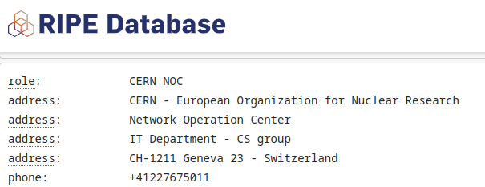

# Footprinting

Passive reconnaissance is the first stage of a pentest, in which an adversary gathers publicly-available, legally-obtained **information** about a **target** without interacting with it.

- **Target**: typically an organization (including individuals and applications)
- **Information**: *useful* data; including IP addresses, subdomains, technologies used, and [PIIs](https://en.wikipedia.org/wiki/Personal_data)

Open-source Intelligence (OSINT) is the collection and analysis of public data to produce actionable intelligence.
> Typical sources include social media, search engines, source code repositories, public records, and data brokers.

## Practice

- Query Google DNS servers for records on `cern.ch`

  ```bash
  dig @8.8.8.8 cern.ch
  ```

- Search [shodan.io](https://shodan.io) database for the associated address

  

- Lookup [RIPE database](https://apps.db.ripe.net/db-web-ui/query) to obtain some public information: a physical address, an email address, and a phone number.

  

## Tooling

As shown, carrying out OSINT manually is a time-consuming process.

- Automation frameworks are almost always used, specialized tools exist for different data types.
- Plenty of tools out there: we'll focus on tools included in the latest Kali distribution.
  - Currently, [spiderfoot](https://kali.tools/?p=76) shows at the top of the list for "Host Information" recon.
  

## Exercise 2

1. Run a SpiderFoot server in docker

   ```bash
   docker run -it --rm --name spiderfoot -p5000:5000 josaorg/spiderfoot sf.py -l 0.0.0.0:5000
   ```

2. Access the server at `localhost:5000`

3. Start a new scan for `example.com`, select only modules `DNS Resolver`, `RIPE` and `WHOIS`.

4. Report and explain the results.
