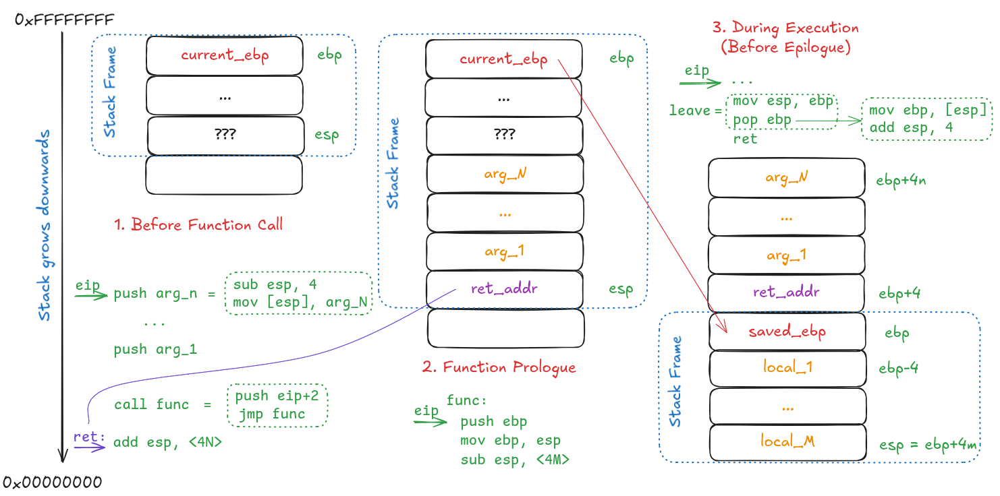

# x86 Disassembly

> Reading: <https://en.wikibooks.org/wiki/X86_Disassembly/Functions_and_Stack_Frames>

- x86 disassembly for the function `int square(int x) { return x * x; }` (follows `cdecl` convention).

    ```assembly
    section .text
        global _start

    square:
        ; prologue
        push ebp          ; save old frame pointer
        mov ebp, esp      ; set the new base
        sub esp, 0        ; no locals 

        ; body
        mov eax, [ebp+8]  ; Get the argument (x) from the stack
        imul eax, eax     ; Compute x * x (result stored in eax)

        ; epilogue
        pop ebp           ; Restore the old base pointer
        ret               ; Move eip back to return address

    _start:
        ; sample call
        push 5            ; Push the argument (5) onto the stack
        call square       ; Call the square function (result in eax)
        add esp, 4        ; Clean up the stack (cdecl requires caller to clean up)
    ```

- Stack view before, during, and after function prologue

    

- Key differences for x86-64 instruction set

  |     | x86 (cdecl)                                                  | x86-64 (System V)                                            |
  | ---------------- | ------------------------------------------------------------ | ------------------------------------------------------------ |
  | Argument passing | All arguments are passed on the stack                        | First 6 integer arguments passed in registers. Rest on stack. |
  | Stack cleanup    | Caller responsible for cleaning up the stack after function call | No stack cleanup is needed for register-passed arguments.    |
  | Register names   | 32-bit registers (`EAX`, `EBX`, `ECX`, etc.).                | 64-bit registers (`RAX`, `RBX`, `RCX`, etc.). Can also access the 32-bit ones |

## Exercise 2

Debug the same binary from Exercise 1 with `gdb -q a.out`

1. Show relevant disassembly for `main` and `square`
1. Set a breakpoint after the `square` function prologue
1. Run the program, it should pause on breakpoint.
1. Show the location where the argument value to `square` function gets stored?
1. Make another breakpoint near `printf` call and continue the execution. How to print the value of the first argument to printf (i.e., the format string)?
